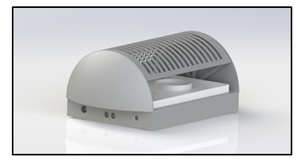
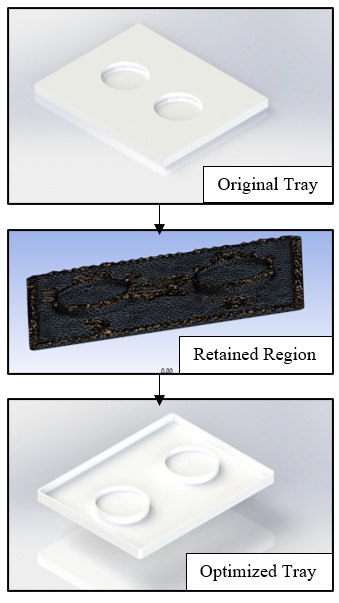
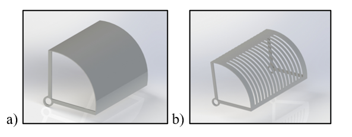
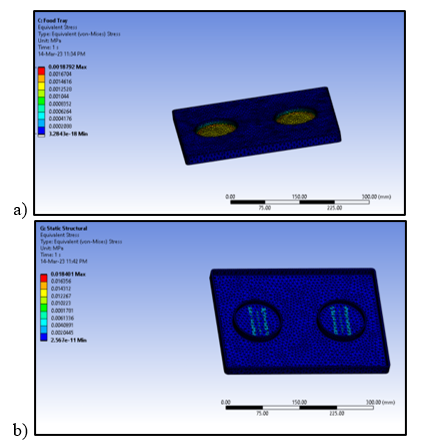
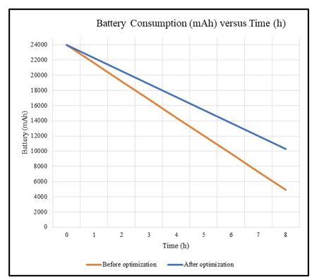

Below is a drop-in **README.md** for the GitHub repository that will host your paper, figures, CAD/FEA files, and any supplementary notebooks.
Just copy-paste it into a file named `README.md`, create the folders shown under **Repository Structure**, export the listed PNGs from your PDF at ≥300 dpi, and you’re ready to push.

---

```markdown
# 🍱 Bento-bot: Topology-Optimised Food-Serving AGV  
Design Changes, Saving Materials & Energy in a Food-Serving Robot via Topology Optimisation
```

<p align="center">
  
</p>

A one-year design study showing how **topology optimisation (TO)** and smart material swaps cut **45 % of the robot’s mass** and up to **45 % of drivetrain power draw** while keeping safety factors ≥ 15.

---

## ✨ Highlights

| What we changed                                | Outcome                                                    |
| ---------------------------------------------- | ---------------------------------------------------------- |
| 🔍 TO on food tray (60–75 % mass goal)         | **-73 % mass** with negligible deformation increase        |
| 🔍 TO on overlapping doors (30–40 % mass goal) | **-33.7 % / -31.2 % mass** inner / outer doors             |
| ♻️ Al → ABS/PEEK electronics box               | **-41 % mass**, safety factor unchanged                    |
| 🪫 Drivetrain re-analysis                      | **-45.5 % motor power (no-load)**, **-25.8 % (full-load)** |
| 🔋 Battery runtime                             | +34 % at full-load (see Fig 8)                             |

---

## 📑 Table of Contents

1. [Background](#background)
2. [Methodology](#methodology)
3. [Key Results](#key-results)
4. [Repository Structure](#repository-structure)
5. [Getting Started](#getting-started)
6. [How to Cite](#how-to-cite)
7. [License](#license)

---

## Background

Indoor food-delivery robots, or **Automated Guided Vehicles (AGVs)**, are gaining traction as labour-saving, hygiene-friendly servers in restaurants. Yet payload, range, and cost are still dominated by chassis mass. **Topology optimisation** reallocates material inside a given design space, delivering lighter, stiffer parts without hand-tuned cut-outs.

Our case study robot—**Bento-bot** (290 × 480 × 198 mm, 7.5 kg nominal load)—was re-engineered with TO on three sub-assemblies: food tray, overlapping doors, and electronics compartment.

---

## Methodology

<p align="center">
  
</p>

1. **Static FEA** sets baseline stresses at full load (7.5 kg).
2. **SIMP TO** targets 30–75 % mass cuts with ≥ 1.5 safety factor.
3. **Shape refinement** converts voxel output to manufacturable geometry.
4. **Material swap** (Al → ABS/PEEK) on electronics box to maximise density contrast.
5. **Re-analysis** validates stress, deformation, and factor of safety.
6. **System-level energy model** recalculates DC-motor power with updated mass and inertia equations (Eq 1–7 in paper).

---

## Key Results

| Visual                                                          | Take-away                                                     |
| --------------------------------------------------------------- | ------------------------------------------------------------- |
|           | Doors shed **\~⅓ mass** with identical kinematics.            |
|    | Tray deflection ↑ only **0.016 mm** after **-73 % mass** cut. |
|  | ABS/PEEK box keeps stress within allowable +2 MPa rise.       |
|           | Motor power drops up to **45 %** (no-load) after mass cut.    |
|             | Full-load runtime gains **\~34 %**.                           |

---

## Repository Structure

```
.
├─ paper/                     # PDF (this study) + BibTeX
├─ cad/
│  ├─ food_tray/              # .SLDPRT, .STEP
│  ├─ doors/
│  └─ electronics_box/
├─ fea/                       # Ansys workbench files
├─ notebooks/                 # Jupyter post-processing scripts
├─ docs/
│  ├─ img/                    # All PNGs listed above
│  └─ drawings/               # 2-D dimensioned DXFs
├─ LICENSE
└─ README.md
```

---

## Getting Started

```bash
# 1 — clone
git clone https://github.com/<your-handle>/bentobot-topopt.git
cd bentobot-topopt

# 2 — (optional) view CAD in FreeCAD
freecad cad/food_tray/Tray.STEP

# 3 — re-run energy calc notebook
pip install -r notebooks/requirements.txt
jupyter notebook notebooks/energy_model.ipynb
```

Need SolidWorks or Ansys? Grab neutral **STEP** and **APDL** exports in `/releases`.

---

## How to Cite

If you use any part of this work, please cite:

bibtex
@article{AlKuhali2025BentoBotTO,
  title   = {Design Changes, Saving Materials and Energy in a Food-Serving Robot via Topology Optimisation},
  author  = {Al-Kuhali, Mohammed Hashem and colleagues},
}
```

---

## License

**MIT** – free for academic & commercial use. See `LICENSE` for details.

---

<p align="center"><em>Less mass → less watts → more meals per charge.</em></p>
```

**Reminder:**

* Export each figure from the PDF, place in `docs/img/`, and keep the filenames identical to those referenced above.
* Commit with Git LFS if any PNG exceeds 5 MB to avoid push-size warnings.
v
